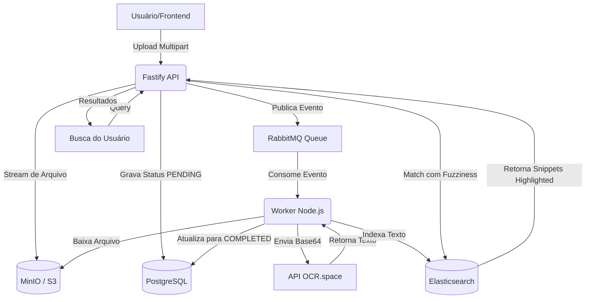

# 📄 Async PDF Processor & Smart Search Engine

Um sistema de alta performance para processamento assíncrono de PDFs, extração de texto via OCR e busca semântica avançada.

Construído com base nos princípios da **Clean Architecture**, este projeto resolve o desafio clássico de lidar com uploads e processamentos pesados de arquivos (I/O e CPU-bound) sem bloquear a API principal ou comprometer a memória do servidor.

Fiz esse projeto justamente para dar um passo além dos CRUDs básicos e brincar com um ecossistema mais avançado usando ferramentas gratuitas. Mergulhei no RabbitMQ para entender o fluxo completo de mensageria (filas, jobs, workers, consumers). Também aproveitei para configurar Dead Letter Queues (DLQs) como rede de segurança contra falhas e usei o padrão Singleton no código. Foi o cenário perfeito para testar processamento assíncrono no mundo real.

## 🚀 Tecnologias e Stack


- **Backend:** Node.js, Fastify, TypeScript
- **Mensageria:** RabbitMQ (com DLQ configurada)
- **Banco de Dados Relacional:** PostgreSQL + Drizzle ORM
- **Object Storage:** MinIO (S3 Compatible)
- **Motor de Busca:** Elasticsearch (com Analyzer PT-BR e Highlighting)
- **Inteligência/OCR:** OCR.space API
- **Validação:** Zod
- **Infraestrutura:** Docker & Docker Compose

## 🧠 Arquitetura do Sistema

O sistema é dividido em dois escopos principais (Produtor e Consumidor), orquestrados para rodar de forma paralela no mesmo processo durante a inicialização, mantendo o fluxo de dados totalmente assíncrono e desacoplado.



### 🎯 Principais Decisões Arquiteturais

1. **Upload via Streams:** Os arquivos não são carregados para a memória RAM do servidor Node.js. Eles fluem diretamente da requisição HTTP para o bucket do MinIO, permitindo o upload de arquivos massivos sem risco de _Out of Memory_ (OOM).
2. **Processamento Assíncrono:** A extração de texto (OCR) exige muita CPU. A API delega esse trabalho publicando o ID do documento numa fila RabbitMQ e respondendo `202 Accepted` imediatamente ao cliente.
3. **Resiliência e Tolerância a Falhas (DLQ):** O RabbitMQ foi configurado com filas duráveis (_Durable Queues_) e confirmação manual (_Manual Ack_). Se o processamento do Worker falhar de forma irrecuperável, a mensagem é automaticamente roteada para uma **Dead Letter Queue (DLQ)** através de uma Dead Letter Exchange (DLX), garantindo _Zero Data Loss_.
4. **Motor de Busca Textual:** O texto bruto dos PDFs não fica no PostgreSQL. Ele é indexado no Elasticsearch utilizando o _Brazilian Analyzer_ para ignorar acentos e stop-words. A rota de busca suporta _Fuzziness_ (erros de digitação) e retorna recortes do texto original marcados em HTML (_Highlighting_).

## 🛠️ Como rodar o projeto localmente

### 1. Pré-requisitos

- Node.js (25)
- pnpm
- Docker e Docker Compose
- Uma chave gratuita da API do OCR.space.

### 2. Configuração do Ambiente

Clone o repositório e crie o arquivo de variáveis de ambiente:

```bash
git clone https://github.com/seu-usuario/seu-repositorio.git
cd seu-repositorio

```

_Preencha o arquivo `.env` com as suas credenciais, como URLs do banco, RabbitMQ, Elastic e MinIO._
_Algumas informações já estão disponíveis via arquivo .env.example._

### 3. Subindo a Infraestrutura

Inicie os containers do PostgreSQL, RabbitMQ, MinIO e Elasticsearch:

```bash
docker-compose up -d

```

### 4. Instalação e Execução

Instale as dependências e rode as migrações do banco de dados (Drizzle) (pnpm é obrigatório):

```bash
corepack enable
pnpm install
pnpm exec drizzle-kit push

```

O sistema foi arquitetado para simplificar a inicialização. O Worker de processamento em segundo plano é instanciado em paralelo junto com o servidor Fastify no mesmo processo.

Para iniciar a API e o Consumidor da fila simultaneamente, basta rodar:

```bash
pnpm start:dev

```

## 📚 Endpoints Principais

- `POST /upload`: Recebe o `multipart/form-data` do PDF e o salva via Stream no MinIO e os metadados no Postgres. Retorna o `documentId`.
- `GET /search?q=termo`: Busca no Elasticsearch e retorna os IDs dos documentos junto com os recortes de texto (_snippets_) onde a palavra aparece envolvida pela tag de destaque.

## 👨‍💻 Autor

**Erik Miqueias Pereira Costa**

- Desenvolvedor Full Stack
- [LinkedIn](https://www.google.com/search?q=https://www.linkedin.com/in/erikmiqueias) | [GitHub](https://www.google.com/search?q=https://github.com/erikmiqueias)
